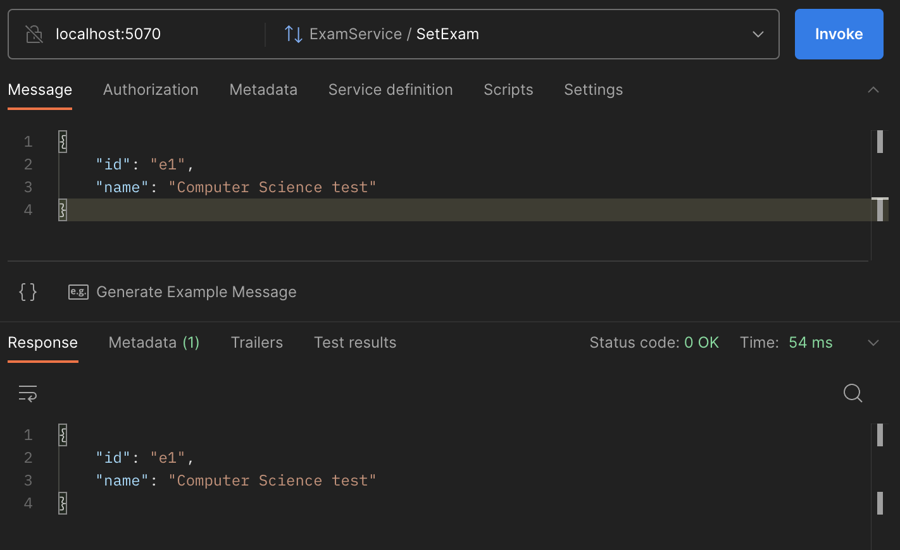
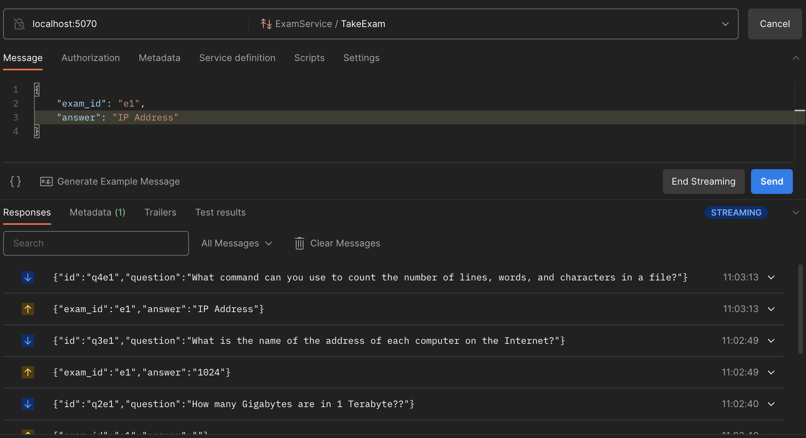

# Exams with grpc

These project consists of a service that allows you to manage students
information, set exams, create exam questions, enroll students in these
exams and allow them to take the tests.

The project service uses gRPC protocol which uses HTTP/2 and protobufers.
So, questions creation, students enrollment can be done through client-side
streaming, also, the exam can be taken with a bidirectional (server-client)
streaming and the list of students per exam can be streamed to the client.
The information is backed up into a PostgresDB.

## Instructions

To start your postgres DB into a Docker container, run:

```console
  docker build ./database -t grpc-db
```

```console
  docker run -p 54321:5432 grpc-db
```

Then, to start the student and exam services:

```console
  go run cmd/student/main.go
```

```console
  go run cmd/exam/main.go
```

Now, student and exam services can be consumed through some tool
like postman creating a gRPC request, selecting a method, and if
it is the case, generating a message template:

- To create a new student register:


- To get a student by id:


- To create an exam:



- To set exam questions:


- To enroll students in your exam:


- To get students per exam:


- To take the exam:



If you want to run an already prepared example:

```console
  go run client/student/main.go
```

```console
  go run client/exam/main.go
```
